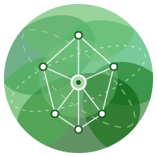

# ClimateNet MCP

<p align="center">
  
  <br />
  <a href="https://climatenet-mcp.tomauger.am/mcp">
    
  </a>
  <a href="./LICENSE">
    
  </a>
  <br />
  MCP server for querying ClimateNet environmental monitoring data from Armenia through Codex, Claude, and other MCP clients.
</p>

> `climatenet-mcp` is an independent project and is not affiliated with, endorsed by, or maintained by ClimateNet.

## About ClimateNet

[ClimateNet](https://climatenet.am/en) is an Armenian environmental monitoring
network that publishes data from monitoring devices across the country. This MCP
server wraps ClimateNet's [public API](https://climatenet.am/en/api/) so agents
can discover devices, inspect sensor status, and query readings through
structured MCP tools.

## Features

- 🌐 Hosted Streamable HTTP MCP endpoint
- 🇦🇲 ClimateNet environmental monitoring data from Armenia
- 📍 Device discovery with region, status, issue, and sensor filters
- 📈 Latest readings, historical readings, graph data, and device comparisons
- 🤖 Read-only tools designed for agent and assistant workflows

## Quickstart

The hosted Streamable HTTP MCP endpoint is:

```text
https://climatenet-mcp.tomauger.am/mcp
```

### Codex

Install the server:

```bash
codex mcp add climatenet --url https://climatenet-mcp.tomauger.am/mcp
```

Verify it:

```bash
codex mcp get climatenet
codex mcp list
```

This writes a config equivalent to:

```toml
[mcp_servers.climatenet]
url = "https://climatenet-mcp.tomauger.am/mcp"
enabled = true
```

Restart Codex after adding the server.

### Claude Code

Install the server:

```bash
claude mcp add --transport http --scope user climatenet https://climatenet-mcp.tomauger.am/mcp
```

Verify it:

```bash
claude mcp get climatenet
claude mcp list
```

### Claude Desktop (Chat)

Claude Desktop's Chat tab does not support plugins, only MCP connectors. Add a
custom remote connector in **Settings → Connectors** with this URL:

```text
https://climatenet-mcp.tomauger.am/mcp
```

Alternatively, bridge it through `mcp-remote` in `claude_desktop_config.json`:

```json
{
  "mcpServers": {
    "climatenet": {
      "command": "npx",
      "args": ["mcp-remote", "https://climatenet-mcp.tomauger.am/mcp"]
    }
  }
}
```

Restart Claude Desktop after updating the config.

## Plugin (Claude Code & Cowork)

For Claude Code and Cowork users, this repo also ships as a plugin that bundles the MCP server with a `climatenet-query` skill that teaches Claude how to chain the tools effectively.

### Claude Code (via marketplace)

```bash
/plugin marketplace add tom-auger/climatenet-mcp
/plugin install climatenet@climatenet-mcp
```

Or, from a local clone:

```bash
/plugin marketplace add /path/to/climatenet-mcp
/plugin install climatenet@climatenet-mcp
```

### Cowork

Cowork lives inside the Claude Desktop app under the **Cowork** tab.

1. Download `climatenet.plugin` from the [latest release](https://github.com/tom-auger/climatenet-mcp/releases/latest)
2. Open Claude Desktop and switch to the **Cowork** tab
3. In the left sidebar, click **Customize**
4. Click **Browse plugins**, then choose **upload a custom plugin file**
5. Select the `climatenet.plugin` file you downloaded

The plugin saves locally to your machine and the `climatenet-query` skill plus MCP server become available immediately.

## Tools

- `list_devices` - list ClimateNet devices with optional status, region, issue, and sensor filters.
- `get_device` - fetch metadata for one device.
- `get_latest_reading` - fetch the latest environmental reading for one device.
- `get_device_readings` - fetch documented API readings, normalized from `keys` plus row arrays into objects.
- `get_device_graph` - fetch 15-minute graph data for one device and optionally one metric.
- `compare_devices` - fetch aligned graph series for multiple devices for one metric.

## Local Development

```bash
pnpm install
pnpm dev
```

The local Express Streamable HTTP endpoint is:

```text
http://localhost:3000/mcp
```

If port 3000 is already in use, choose another port:

```bash
PORT=3030 pnpm dev
```

Useful checks:

```bash
pnpm build
pnpm smoke
pnpm smoke:edge
```

## Cloudflare Workers

The Worker entrypoint exposes the same MCP tools through Cloudflare's Streamable HTTP
handler at `/mcp`.

Run the Worker locally:

```bash
pnpm dev:worker
```

The local Worker endpoint is:

```text
http://localhost:8788/mcp
```

Deploy with:

```bash
pnpm deploy:worker
```

The deployed endpoint will be:

```text
https://climatenet-mcp.<account>.workers.dev/mcp
```
